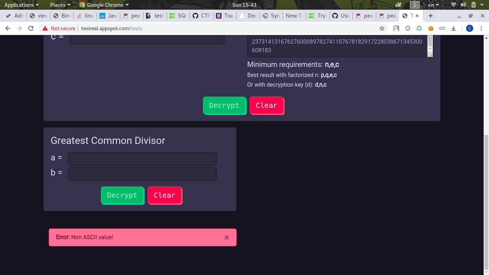

# RSA
```
Can you help Bob retrieve the two messages for a flag?
```
[Authenticated Channel ](auth_channel.txt)[Encrypted Channel](enc_channel.txt)

Authenticated Channel:
```
Authenticated (unhashed) channel:
n = 59883006898206291499785811163190956754007806709157091648869
e = 65537
c = 23731413167627600089782741107678182917228038671345300608183
```

Encrypted Channel:
```
Encrypted channel:
n = 165481207658568424313022356820498512502867488746572300093793
e = 65537
c = 150635433712900935381157860417761227624682377134647578768653
```

With RSA, our team build a CTF tools in our [website](http://tworeal.appspot.com/tools)

Which can auto factorize the `n`, find the `d` and decrypt the message

First, I tried the auth channel, but the decrypted message is not in ASCII range!


Next, I tried the enc channel, it get the message `peaCTF{f4ct0r`


`peaCTF{f4ct0r` is just half of the flag, next half must in the auth channel

At first, I guess **Authenticated (unhashed) channel** means the message haven't encrypt yet

So I test with some python, but some is not in ASCII range:
```python
>>> from Crypto.Util.number import long_to_bytes
>>> long_to_bytes(23731413167627600089782741107678182917228038671345300608183)
'\x03\xc7\xd7\x83\xa2\x92\xc9\x8e}u\xcd\x18.)V\xd8\xa9\x8f\x03\r\xa3e\xd1\x14\xb7'
```

After a few trial and error, I realized the `e` is `d` (Decryption key):
```python
from Crypto.Util.number import long_to_bytes
n = 59883006898206291499785811163190956754007806709157091648869
e = 65537
c = 23731413167627600089782741107678182917228038671345300608183
print long_to_bytes(pow(c,e,n))
```
Get the result: `1ng1sfun}`

Concat both message together we get the flag! : `peaCTF{f4ct0r1ng1sfun}`

## Flag
> peaCTF{f4ct0r1ng1sfun}